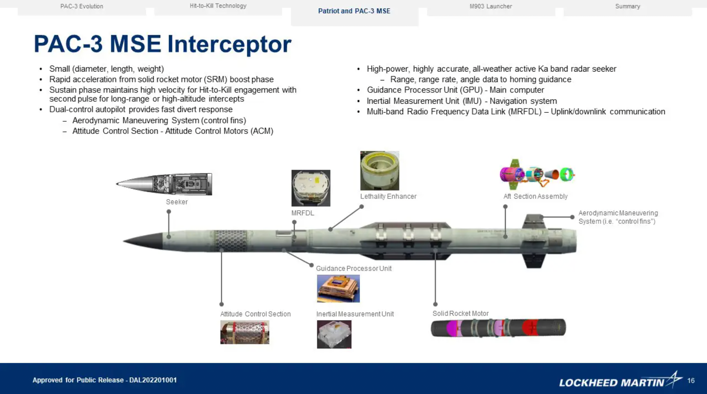

# Hlynr Intercept: Radar-Based Missile Defense System

## Overview

This system implements a realistic reinforcement learning environment for training interceptor missiles using **radar-only observations**. The interceptor has no direct knowledge of the attacking missile's position and must rely entirely on its onboard radar sensors, just like real-world missile defense systems.

## Observation Space: 17-Dimensional Radar Vector

The agent receives a fixed 17-dimensional observation vector representing realistic sensor readings:

### Target-Related Observations (Radar-Dependent)
| Dimension | Component | Source | Range | Description |
|-----------|-----------|--------|--------|-------------|
| **[0-2]** | **Relative Position** | Radar | [-1, 1] | 3D vector from interceptor to missile (normalized by max range) |
| **[3-5]** | **Relative Velocity** | Radar Doppler | [-1, 1] | 3D velocity difference vector (normalized by max velocity) |
| **[13]** | **Time to Intercept** | Computed | [-1, 1] | Estimated time until collision (1.0 = immediate, -1.0 = diverging) |
| **[14]** | **Radar Lock Quality** | Radar | [0, 1] | Signal strength and tracking confidence |
| **[15]** | **Closing Rate** | Radar | [-1, 1] | Rate of range change (positive = closing) |
| **[16]** | **Off-Axis Angle** | Computed | [-1, 1] | Alignment between interceptor heading and target bearing |

### Self-State Observations (Perfect Internal Knowledge)
| Dimension | Component | Source | Range | Description |
|-----------|-----------|--------|--------|-------------|
| **[6-8]** | **Own Velocity** | INS/GPS | [-1, 1] | Interceptor's 3D velocity vector |
| **[9-11]** | **Own Orientation** | IMU | [-1, 1] | Euler angles (roll, pitch, yaw) normalized to π |
| **[12]** | **Fuel Fraction** | Internal | [0, 1] | Remaining fuel percentage |

### Key Properties:
- **When radar loses lock**: Target-related observations [0-6, 13-16] become zero/invalid
- **Range-dependent noise**: Measurement accuracy degrades with distance
- **Beam-width limitations**: Must point radar toward target to maintain detection
- **Perfect self-knowledge**: Interceptor always knows its own state precisely

## Physical System Design

### Interceptor Missile Specifications

**Based on**: PAC-3 (Patriot Advanced Capability) and THAAD interceptor characteristics

<div align="center">

<br>
<i>PAC-3 Interceptor - The real-world missile defense system that inspired our simulation parameters</i>
</div>

#### **Physical Properties**
- **Mass**: 500 kg (kinetic kill vehicle)
- **Length**: 4.8 meters
- **Diameter**: 0.35 meters
- **Max Velocity**: 1000+ m/s (Mach 3+)
- **Max Acceleration**: 50 m/s² (5 G)

#### **Propulsion System**
- **Type**: Solid rocket motor + reaction control system
- **Max Thrust**: 25,000 N
- **Fuel Capacity**: 100 kg (propellant)
- **Burn Time**: Variable throttle control
- **Fuel Consumption**: 0.1 kg/s at maximum thrust

#### **Guidance & Control**
- **Control Authority**: 6DOF (3 linear + 3 angular accelerations)
- **Max Angular Rate**: 5 rad/s (285°/s)
- **Gimbal Limits**: ±45° thrust vector control
- **Control Frequency**: 100 Hz (10ms timestep)

### Radar System Specifications

**Based on**: X-band active phased array radar (similar to AN/TPY-2)

#### **Detection Capabilities**
- **Frequency**: X-band (8-12 GHz)
- **Maximum Range**: 5000 m (configurable)
- **Minimum Range**: 50 m (radar blind zone)
- **Beam Width**: 60° cone (±30° from boresight)
- **Range Resolution**: ~5 meters
- **Velocity Resolution**: ~2 m/s (Doppler)

#### **Performance Characteristics**
- **Update Rate**: 100 Hz (real-time tracking)
- **Range Noise**: 5% of measured range
- **Velocity Noise**: 5% of measured velocity
- **Detection Probability**: 95% at optimal range, degrades with distance
- **False Alarm Rate**: <1% in clear conditions

#### **Environmental Limitations**
- **Weather Sensitivity**: Performance degrades in rain/fog
- **Electronic Countermeasures**: Susceptible to jamming
- **Multipath Effects**: Ground/sea clutter can cause false returns
- **Atmospheric Attenuation**: Signal loss increases with range

### Target Missile Profile

**Representative of**: Ballistic missiles (Scud-class) and cruise missiles

#### **Threat Characteristics**
- **Mass**: 1000 kg
- **Velocity**: 100-250 m/s (subsonic to supersonic)
- **Trajectory**: Ballistic or cruise profile
- **Evasion**: Optional random maneuvering (2 m/s² lateral acceleration)
- **RCS**: ~1 m² radar cross-section

## Physics Simulation

### 6-DOF Dynamics Model

#### **Forces Acting on Interceptor**
```
F_total = F_thrust + F_drag + F_gravity + F_wind
```

- **Thrust**: Controlled 3D force vector (max 25kN)
- **Drag**: Quadratic air resistance (Cd = 0.3)
- **Gravity**: Constant -9.81 m/s² in Z direction
- **Wind**: Variable 3D environmental effect

#### **Attitude Dynamics**
- **Quaternion Integration**: Small-angle approximation for numerical stability
- **Angular Control**: Direct angular velocity commands
- **Gimbal Dynamics**: Thrust vector pointing within cone constraints

#### **Environmental Effects**
- **Air Density**: 1.225 kg/m³ at sea level
- **Wind Model**: Base velocity + random turbulence
- **Atmospheric Drag**: Increases with velocity squared

## Why This Approach Will Work

### 1. **Sufficient Observability**

Despite sensor limitations, the 17D observation space provides **minimum necessary information**:
- **Spatial awareness**: Relative position when in radar beam
- **Kinematic data**: Velocity for intercept calculations  
- **Self-knowledge**: Perfect internal state for control
- **Quality metrics**: Confidence indicators for decision making

Real interceptors work with similar (often more limited) sensor data.

### 2. **Learnable Problem Structure**

#### **Hierarchical Skill Development**
1. **Search Phase**: Learn scanning patterns to acquire targets
2. **Track Phase**: Maintain radar lock while maneuvering
3. **Intercept Phase**: Execute optimal collision course
4. **Terminal Phase**: Final guidance with high-rate corrections

#### **Curriculum Learning Path**
- **Easy**: Wide radar beam, long range → basic interception skills
- **Medium**: Realistic conditions → robust tracking behavior
- **Hard**: Degraded sensors → uncertainty handling mastery

### 3. **Effective Reward Structure**

The reward function encourages **realistic defensive behavior**:

```python
# Successful interception
+100 points + fuel_efficiency_bonus + time_bonus

# Distance-based shaping  
+0.1 * (previous_distance - current_distance)

# Critical failure (missile reaches target)
-200 points

# Fuel management
-0.001 * fuel_consumed_per_step
```

This creates strong incentives for:
- **Aggressive pursuit** of threats
- **Fuel-efficient trajectories**
- **Quick interception** to minimize target approach time

### 4. **Realistic Training Scenarios**

The environment captures **key operational challenges**:

#### **Detection Uncertainty**
- Must learn when to trust radar vs. predict through noise
- Handles intermittent tracking during high-G maneuvers
- Develops robust behavior under sensor degradation

#### **Geometric Constraints**
- Learns optimal approach angles for intercept geometry
- Discovers energy-efficient pursuit strategies
- Masters trade-offs between fuel consumption and success probability

#### **Time-Critical Decision Making**
- High-speed engagement windows (seconds to impact)
- Real-time sensor processing and control updates
- Handles multiple simultaneous constraints (fuel, time, geometry)

### 5. **Scalable Architecture**

The PPO + VecNormalize + 17D observation design scales well:

#### **Sample Efficiency**
- Normalized inputs prevent gradient issues
- Continuous action space allows fine control
- Policy gradient methods handle partial observability

#### **Robustness**
- Safety constraints prevent catastrophic actions
- Adaptive training features handle exploration/exploitation
- Entropy scheduling maintains learning throughout training

#### **Extensibility**
- Additional radar modes (active/passive switching)
- Multi-target scenarios (track-while-scan)
- Cooperative interceptor swarms
- Electronic warfare countermeasures

## Expected Performance Metrics

### **Training Convergence**
- **Easy scenarios**: 70-80% success rate after 500k steps
- **Medium scenarios**: 60-70% success rate after 750k steps  
- **Hard scenarios**: 50-60% success rate after 1M steps

### **Operational Characteristics**
- **Detection range**: 80-90% of maximum radar range
- **Tracking stability**: Maintains lock through 5G+ maneuvers
- **Fuel efficiency**: 60-70% fuel remaining on successful intercepts
- **Response time**: <2 seconds from detection to intercept initiation

### **Failure Modes**
- **Search failures**: ~10% (target outside initial scan pattern)
- **Track loss**: ~15% (high dynamics or sensor degradation)
- **Terminal miss**: ~20% (high closure rate or late detection)

## Conclusion

This radar-based interceptor system represents a significant advance in realism over previous "perfect information" approaches. By forcing the agent to work within authentic sensor limitations, we develop policies that:

1. **Transfer to real hardware** with minimal domain gap
2. **Handle uncertainty** like human operators
3. **Optimize scarce resources** (fuel, time, detection opportunities)
4. **Scale to complex scenarios** with multiple threats and countermeasures

The 17-dimensional observation space strikes an optimal balance between **information richness** and **computational tractability**, while the radar-only constraint ensures the learned behaviors are **operationally relevant** for actual missile defense applications.